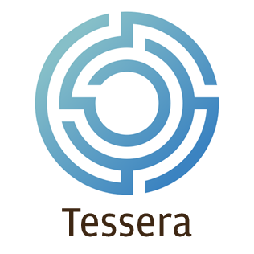

[](https://travis-ci.org/jpmorganchase/tessera)
[](https://codecov.io/gh/jpmorganchase/tessera)


# 

> __Important: Database change__ <br/>A timestamp is now recorded with each encrypted transaction stored in the Tessera DB.  To update an existing DB to work with this version of Tessera, execute one of the provided [alter scripts](ddls/add-timestamp)

Tessera is a stateless Java system that is used to enable the encryption, decryption, and distribution of private transactions for [Quorum](https://github.com/jpmorganchase/quorum/).

Each Tessera node:

* Generates and maintains a number of private/public key pairs

* Self manages and discovers all nodes in the network (i.e. their public keys) by connecting to as few as one other node
    
* Provides Private and Public API interfaces for communication:
    * Private API - This is used for communication with Quorum
    * Public API - This is used for communication between Tessera peer nodes
    
* Provides two way SSL using TLS certificates and various trust models like Trust On First Use (TOFU), whitelist, 
    certificate authority, etc.
    
* Supports IP whitelist
  
* Connects to any SQL DB which supports the JDBC client

## Prerequisites
- [Java 8](http://www.oracle.com/technetwork/java/javase/downloads/jre8-downloads-2133155.html)
- [Maven](https://maven.apache.org) (if installing from source)
- [libsodium](https://download.libsodium.org/doc/installation/) (if using kalium as the NaCl implementation)

## Building Tessera
To build and install Tessera:
1. Clone this repo
1. Build using Maven (see below)


### Selecting an NaCl Implementation 
Tessera can use either the [jnacl](https://github.com/neilalexander/jnacl) or [kalium](https://github.com/abstractj/kalium) NaCl cryptography implementations.  The implementation to be used is specified when building the project:

#### jnacl (default)

`mvn install`

#### kalium

Install libsodium as detailed on the [kalium project page](https://github.com/abstractj/kalium), then run
 
`mvn install -P kalium,jersey`


## Running Tessera
`java -jar tessera-app/target/tessera-app-${version}-app.jar -configfile config.json`

Once Tessera has been configured and built, you may want to copy the .jar to another location, create an alias and add it to your PATH:

`alias tessera="java -jar /path/to/application-${version}-app.jar"`

You will then be able to more concisely use the Tessera CLI commands, such as:

```
tessera -configfile /path/to/config.json
```

and

```
tessera help
```

By default, Tessera uses an H2 database.  To use an alternative database, add the necessary drivers to the classpath:

```
java -cp some-jdbc-driver.jar:/path/to/tessera-app.jar:. com.quorum.tessera.Launcher
```
For example, to use Oracle database: 
```
java -cp ojdbc7.jar:tessera-app.jar:. com.quorum.tessera.Launcher -configfile config.json
```

[DDLs](ddls/create-table) have been provided to help with defining these databases.

## Configuration

### Config File

A configuration file detailing database, server and network peer information must be provided using the `-configfile`
command line property.

An in-depth look at configuring Tessera can be found on the [Tessera Wiki](https://github.com/jpmorganchase/tessera/wiki/Configuration) and includes details on all aspects of configuration including:
* Cryptographic key config:
    * Using existing private/public key pairs with Tessera
    * How to use Tessera to generate new key pairs 
* TLS config
    * How to enable TLS
    * Choosing a trust mode
 
### Migrating from Constellation to Tessera
Tessera is the service used to provide Quorum with the ability to support private transactions, replacing Constellation.  If you have previously been using Constellation, utilities are provided within Tessera to enable the migration of Constellation configuration and datastores to Tessera compatible formats.  Details on how to use these utilities can be found in the [Tessera Wiki](https://github.com/jpmorganchase/tessera/wiki/Migrating-from-Constellation-to-Tessera).

## Further reading
* The [Tessera Wiki](https://github.com/jpmorganchase/tessera/wiki/) provides additional information on how Tessera works, migrating from Constellation to Tessera, configuration details, and more.
* [Quorum](https://github.com/jpmorganchase/quorum/) is an Ethereum-based distributed ledger protocol that uses Tessera to provide transaction privacy.
* Follow the [Quorum Examples](https://github.com/jpmorganchase/quorum-examples) to see Tessera in action in a demo Quorum network.

# Getting Help
Stuck at some step? Have no fear, the help is here <a href="https://clh7rniov2.execute-api.us-east-1.amazonaws.com/Express/" target="_blank" rel="noopener"></a>
